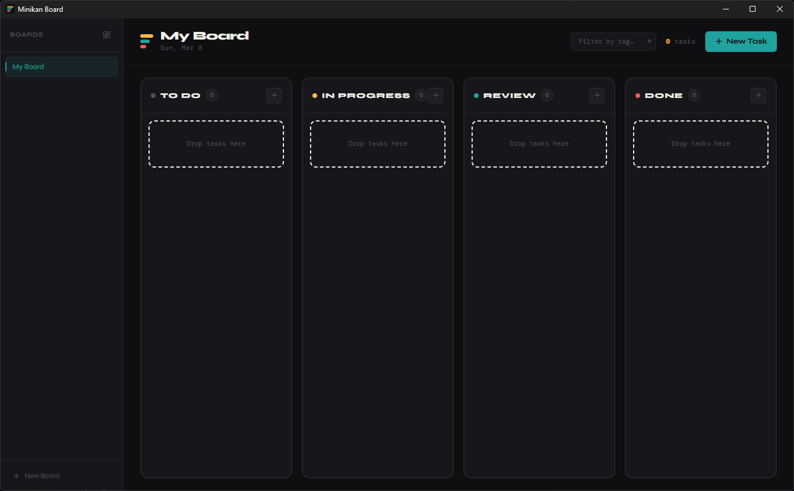
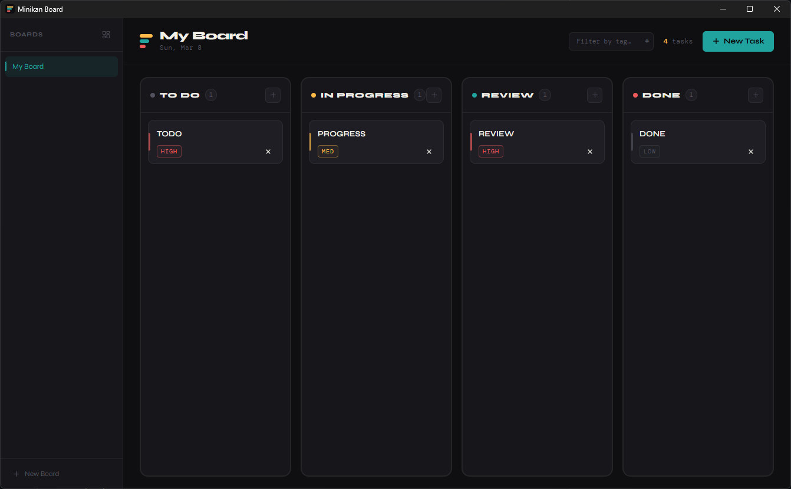

<div align="center">
  
  <h1>Minikan Board</h1>
  <p>A fast, minimal Kanban board for your desktop. No accounts. No sync. Just work.</p>

  <p>
    
    
    
    
    
  </p>
</div>

---

## Overview

Minikan Board is a native desktop Kanban app built with Tauri and React. Tasks are persisted to a local SQLite database — nothing leaves your machine. It supports multiple boards, drag-and-drop between columns, priority levels, tag filtering, and a fully responsive layout that adapts from a compact mobile-width window to an ultrawide desktop view.

---

## Screenshot




---

## Features

- **Multiple boards** — create, rename, and delete boards from the collapsible sidebar
- **Four columns** — To Do, In Progress, Review, Done
- **Drag and drop** — pointer-event based, works on touch and stylus input
- **Task details** — title, description, priority (low / medium / high), tags
- **Tag filtering** — real-time filter across all columns by tag name
- **Responsive layout** — four breakpoints from single-column stack to ultrawide
- **Fully offline** — all data stored locally in SQLite, no network required

---

## Tech Stack

| Layer         | Technology                                                 |
| ------------- | ---------------------------------------------------------- |
| Desktop shell | [Tauri 2](https://tauri.app)                               |
| Frontend      | [React 19](https://react.dev) + [Vite](https://vitejs.dev) |
| Styling       | [Tailwind CSS v4](https://tailwindcss.com)                 |
| Database      | SQLite via [SQLx](https://github.com/launchbadge/sqlx)     |
| Icons         | [Lucide React](https://lucide.dev)                         |
| IDs           | [nanoid](https://github.com/ai/nanoid)                     |

---

## Prerequisites

Before you begin, make sure you have the following installed:

- [Node.js](https://nodejs.org) 18+
- [Rust](https://rustup.rs) stable toolchain (`rustup update stable`)
- Platform-specific Tauri dependencies — follow the [Tauri prerequisites guide](https://tauri.app/start/prerequisites/) for your OS

---

## Getting Started

```bash
# 1. Clone the repository
git clone https://github.com/your-username/minikan-board.git
cd minikan-board

# 2. Install frontend dependencies
npm install

# 3. Start the development build
#    Hot-reloads the frontend; rebuilds Rust backend on change
npm run tauri dev

# 4. Build a release binary for your platform
npm run tauri build
```

The SQLite database is created automatically on first launch at:

| Platform | Path                                                     |
| -------- | -------------------------------------------------------- |
| macOS    | `~/Library/Application Support/minikan-board/minikan.db` |
| Windows  | `%APPDATA%\minikan-board\minikan.db`                     |
| Linux    | `~/.local/share/minikan-board/minikan.db`                |

---

## Project Structure

```
minikan-board/
├── src/                          # React frontend
│   ├── components/
│   │   ├── Kanbanboard.jsx       # Root — boards, layout orchestration, modal state
│   │   ├── Kanbancolumn.jsx      # Column with per-column drag-over highlighting
│   │   ├── Kanbancard.jsx        # Card with priority pip and tag badges
│   │   ├── Addtaskmodal.jsx      # New task modal (title, desc, priority, tags)
│   │   ├── Boardheader.jsx       # Header with tag filter input and task count
│   │   └── Boardsidebar.jsx      # Board switcher with create / rename / delete
│   ├── hooks/
│   │   ├── useCards.js           # Card CRUD with optimistic updates
│   │   ├── useDragAndDrop.js     # Pointer-event drag and drop (ref-safe)
│   │   └── useWindowWidth.js     # Responsive layout breakpoint tracking
│   ├── lib/
│   │   └── kanbanConstants.js    # Shared COLUMNS definition + deserializeCard
│   └── index.css                 # Tailwind v4 theme tokens + keyframe animations
│
└── src-tauri/                    # Rust / Tauri backend
    ├── src/
    │   ├── main.rs
    │   ├── lib.rs                # Tauri builder, plugin setup, AppState init
    │   ├── commands/
    │   │   ├── mod.rs            # AppState struct, command re-exports
    │   │   ├── card_commands.rs  # get/add/delete/move/update card commands
    │   │   └── board_commands.rs # get/add/rename/delete board commands
    │   ├── db/
    │   │   ├── mod.rs
    │   │   ├── connection.rs     # SQLitePoolOptions + migration runner
    │   │   ├── card_repo.rs      # Card queries (CRUD + move)
    │   │   └── board_repo.rs     # Board queries (CRUD + count guard)
    │   └── models/
    │       ├── mod.rs
    │       ├── card.rs           # Card + NewCard structs (SQLx + Serde)
    │       └── board.rs          # Board + NewBoard structs
    └── migrations/               # SQLx versioned migration files
```

---

## Tauri Commands

The frontend communicates with the Rust backend via Tauri's `invoke` API. All commands are async and return `Result<T, String>`.

| Command        | Arguments                                        | Returns   |
| -------------- | ------------------------------------------------ | --------- |
| `get_boards`   | —                                                | `Board[]` |
| `add_board`    | `{ board: { id, name } }`                        | `Board`   |
| `rename_board` | `{ id, name }`                                   | `void`    |
| `delete_board` | `{ id }`                                         | `void` ¹  |
| `get_cards`    | `{ boardId }`                                    | `Card[]`  |
| `add_card`     | `{ card: NewCard }`                              | `void`    |
| `delete_card`  | `{ id }`                                         | `void`    |
| `move_card`    | `{ id, column }`                                 | `void`    |
| `update_card`  | `{ id, title?, description?, priority?, tags? }` | `void`    |

> ¹ `delete_board` returns an error if it would remove the last remaining board.

---

## Data Model

```sql
CREATE TABLE boards (
  id         TEXT PRIMARY KEY,
  name       TEXT NOT NULL,
  created_at TIMESTAMP NOT NULL
);

CREATE TABLE cards (
  id          TEXT PRIMARY KEY,
  board_id    TEXT NOT NULL REFERENCES boards(id),
  title       TEXT NOT NULL,
  description TEXT NOT NULL DEFAULT '',
  priority    TEXT NOT NULL DEFAULT 'medium', -- 'low' | 'medium' | 'high'
  "column"    TEXT NOT NULL DEFAULT 'todo',   -- 'todo' | 'progress' | 'review' | 'done'
  tags        TEXT NOT NULL DEFAULT '',       -- comma-separated, e.g. "design,backend"
  created_at  TIMESTAMP NOT NULL
);
```

> Tags are stored as a comma-separated string in SQLite and deserialized into a `string[]` by `deserializeCard()` in `kanbanConstants.js` when loaded into the frontend. They are re-joined before being written back.

---

## Responsive Layouts

Window width is tracked by `useWindowWidth` and the available area (after subtracting sidebar width) is mapped to one of four layouts in `KanbanBoard`:

| Layout       | Available width | Description                                         |
| ------------ | --------------- | --------------------------------------------------- |
| `stack`      | < 640px         | Single-column, full-width cards, outer page scrolls |
| `grid`       | 640–1099px      | 2×2 grid, each column scrolls internally            |
| `horizontal` | 1100–1599px     | Four columns side by side, standard padding         |
| `wide`       | ≥ 1600px        | Four columns with increased padding and type scale  |

---

## Design Tokens

All tokens are defined in `index.css` under `@theme` and consumed as standard Tailwind utility classes (e.g. `bg-teal`, `text-gold`, `border-coral`).

| Token        | Hex       | Role                                             |
| ------------ | --------- | ------------------------------------------------ |
| `gold`       | `#ffba49` | Medium priority, task count, new board creation  |
| `teal`       | `#20a39e` | Primary CTA, active board indicator, edit/rename |
| `coral`      | `#ef5b5b` | High priority, delete actions                    |
| `base`       | `#0f0f11` | App background                                   |
| `surface`    | `#17171b` | Sidebar and column backgrounds                   |
| `card`       | `#1e1e24` | Card backgrounds                                 |
| `card-hover` | `#25252d` | Card hover state                                 |
| `modal`      | `#1a1a21` | Modal background                                 |

---

## Recommended IDE Setup

[VS Code](https://code.visualstudio.com/) with the following extensions:

| Extension                                                                                                  | Purpose                                  |
| ---------------------------------------------------------------------------------------------------------- | ---------------------------------------- |
| [Tauri](https://marketplace.visualstudio.com/items?itemName=tauri-apps.tauri-vscode)                       | Tauri command palette and config support |
| [rust-analyzer](https://marketplace.visualstudio.com/items?itemName=rust-lang.rust-analyzer)               | Rust language server                     |
| [Tailwind CSS IntelliSense](https://marketplace.visualstudio.com/items?itemName=bradlc.vscode-tailwindcss) | Autocomplete for Tailwind utilities      |
| [ESLint](https://marketplace.visualstudio.com/items?itemName=dbaeumer.vscode-eslint)                       | JavaScript/JSX linting                   |

---

## License

[MIT](./LICENSE)
